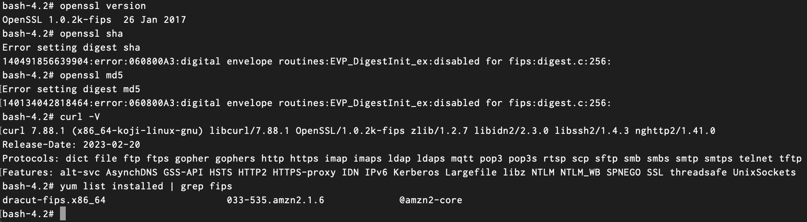

# Creating a fips-y docker environment using amazonlinux v2
May 04, 2023

If you are a security professional working for a public or private company with U.S. government contracts then chances are you have done compliance work at some point in your career. You have also probably heard of compliance framework examples like NIST, CIS, PCI, and FedRAMP. I frequently work with docker and kubernetes and have recently started deep-diving into FedRAMP compliance. I recently ran into a niche issue that I would like to shed some light on and hopefully guide others through as well.

I should start with a brief synopsis of what FedRAMP is. FedRAMP is a standard that the U.S. government uses to certify that resources used by the government and any 3rd party contractors meet certain data protection requirements. Ensuring data is protected by FIPS (Federal Information Processing Standard) 140-2  and 140-3 lies at the core of FedRAMP. FIPS is a set of cryptographic standards created by NIST to ensure a given system can effectively protect sensitive data.

Unfortunately, a major challenge arises from forcing private companies to implement FedRAMP and other similar compliance standards. For lack of better words, FIPS 140-2 is old but still valid. FIPS 140-2 was made in 2001 by NIST but will remain valid until 2026 (CITE). So how can the U.S. government expect a private company to maintain classic services while also developing and using new technology? Personally, it's been a bit of a challenge, but not impossible. A benefit to creating docker images and production environments with FIPS in mind is that some security burden is taken off the developers. It also lets the security organization have a little more control over the final architecture of an app or service. However, developers will still need to build on top of the FIPS baseimage so it can't be too locked down.

I have noticed that creating FIPS-ready docker container images can sometimes be clumsy. And the effects of forcing developers to build on those docker images has yet to be seen (that would probably be a good followup article). However, there's no way around a FedRAMP certification if you want government contacts.

But enough of my opinion, here is some work I have done with making docker container images FIPS-y.

## FIPS at the Container Level:

You should aim to create Docker images that are as lean as possible. The goal should be to use docker images that are ephemeral; it can be terminated and spun back up with no problems. Here is my Dockerfile I have been experimenting with (it still needs some work…)


```Dockerfile
# Pull base image
FROM amazonlinux:2

# Install OS Updates
RUN yum update -y

# Install fips packages
RUN yum install -y dracut-fips openssl \
    && yum clean all \
    && rm -rf /var/cache/yum

# Set variable to force openssl to use fips
ENV OPENSSL_FIPS=1
```
My baseimage is built on AmazonLinux v2. All I did in the Dockerfile was update the OS and install dracut-fips and the openssl modules. I then cleaned up my install and set an environment variable that forces the openssl module to use the FIPS crypto libraries.

```
docker build -t aws-fips-test -f Dockerfile .
[+] Building 13.1s (7/7) FINISHED                                                                                                 
 => [internal] load build definition from Dockerfile                                                                         0.0s
 => => transferring dockerfile: 260B                                                                                         0.0s
 => [internal] load .dockerignore                                                                                            0.0s
 => => transferring context: 2B                                                                                              0.0s
 => [internal] load metadata for docker.io/library/amazonlinux:2                                                             0.5s
 => [1/3] FROM docker.io/library/amazonlinux:2@sha256:3385565b4b75c4f15fd59a5dd7e4510ac5ad4b1825df9deed6be6af1092c8829       0.0s
 => CACHED [2/3] RUN yum update -y                                                                                           0.0s
 => [3/3] RUN yum install -y dracut-fips openssl     && yum clean all     && rm -rf /var/cache/yum                          10.7s
 => exporting to image                                                                                                       1.7s
 => => exporting layers                                                                                                      1.7s
 => => writing image sha256:8f51abc201f2dfae75077a0c311cc9eb26634c66761bcefcb0f49093bb10df63                                 0.0s 
 => => naming to docker.io/library/aws-fips-test                                                                             0.0s 
```
After building the image I ran it using Docker and hopped into a terminal to prove that FIPS was enabled. I validated fips was installed and working by running the below commands.



The simple tests I ran in the screenshot above can be transfered over to a pipeline.yaml file and run in a separate test stage or during the build stage itself. You could also create a simple script that could be quickly run on the image. The only challenge would be to ensure you have a running container and are actually exectuting the test commands on that running container.


*May the fourth be with you :)* 

```
            .-.
           |o,o|
        ,| _\=/_      .-""-.
        ||/_/_\_\    /[] _ _\
        |_/|(_)|\\  _|_o_LII|_
           \._./// / | ==== | \
           |\_/|"` |_| ==== |_|
           |_|_|    ||" ||  ||
           |-|-|    ||LI  o ||
           |_|_|    ||'----'||
          /_/ \_\  /__|    |__\
```